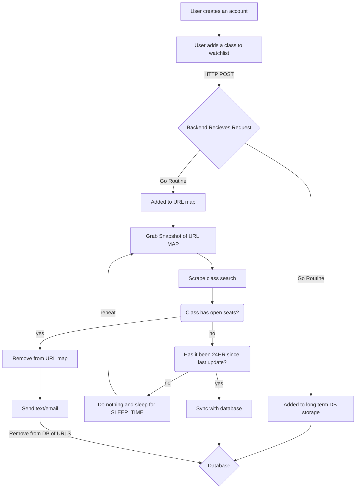

# GO Class Scraper
A simple implementation of a web scraper that will find available seats
at any university that exposes a public api. While I have already written this in rust,
I thought it would be good to get an idea of how well it would perform in GO.

Here is a mock chart of the final implementation. While I do not plan to open source
the final implementation, this can give you a rough idea of what it would be.

Obviously this chart does not account for all cases such as
the class code already being in the database and it already
being scraped. However this should provide a good high-level overview.

